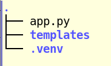

# Jueves 06/02/2025

## UD4. Introducción a la programación

- **08:15 - 09:15**: Sesión 65

## Qué trataremos

Seguimos con **flask** repasando el uso de plantillas y añadiendo el concepto de herencia de plantillas. Prepararemos el menú de nuestra agenda para convertirla en aplicación web:
- [agenda.py](agenda.py)
- [app.py](app.py)
- [index.html](index.html)

## Recursos
- [1] [Página principal del framework Flask](https://flask.palletsprojects.com/es/stable/).
- [2] [Mega tutorial de Flask](https://blog.miguelgrinberg.com/post/the-flask-mega-tutorial-part-i-hello-world).

## Tareas

- Realizaremos algunos ejemplos en clase donde usaremos plantillas y herencia preparando nuestra aplicación agenda.

#### Estructura básica de un proyecto flask:

