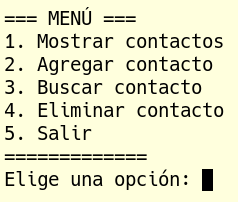

# Miércoles 15/01/2025

## UD4. Introducción a la programación

- **08:15 - 09:15**: Sesión 53

## Qué trataremos
Hoy vamos a dedicar la sesión a preparar un menú para nuestra aplicación. El objetivo será que desde ese menú podamos llamar a funciones creadas anteriormente:

    

## Recursos
- [1] [Python para principiantes - UniWebSidad](https://uniwebsidad.com/libros/python?from=librosweb).
- [2] [Python para principiantes - Microsoft Learn](https://learn.microsoft.com/es-es/training/paths/beginner-python/?utm_source=chatgpt.com).
- [3] [El Libro de Python](https://ellibrodepython.com/).
- [4] [Tutorial oficial de Python - docs-python.org](https://docs.python.org/es/3.13/tutorial/index.html).

## Tareas
- Realizaremos algunos ejemplos a lo largo de la sesión.

