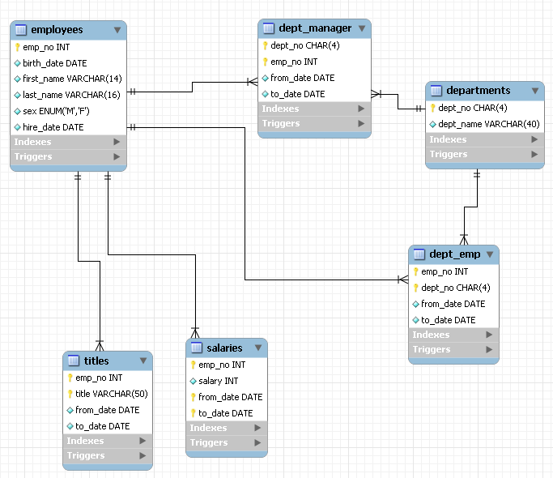

# Jueves 30/01/2025

## UD4. Introducción a la programación

- **08:15 - 09:15**: Sesión 61

## Qué trataremos

Para afianzar los conocimientos haréis un programa parecido al de la agenda pero que permitirá trabajar con los empleados de la tabla employees de MySQL.

Aquí os dejo los archivos [app.py](/Documents/UD4/app_employees/app.py) y [funciones.py](/Documents/UD4/app_employees/funciones.py) resueltos con el listado y la búsqueda de empleados. Recordad que este archivo realiza la conexión a la base de datos de Proxmox y no a la vuestra local. Una vez que probéis que funciona, cambiad los parámetros de conexión a vuestra base de datos local.

## Recursos

- [1] [Python para principiantes - UniWebSidad](https://uniwebsidad.com/libros/python?from=librosweb).
- [2] [Python para principiantes - Microsoft Learn](https://learn.microsoft.com/es-es/training/paths/beginner-python/?utm_source=chatgpt.com).
- [3] [El Libro de Python](https://ellibrodepython.com/).
- [4] [Tutorial oficial de Python - docs-python.org](https://docs.python.org/es/3.13/tutorial/index.html).

## Tareas

- Realizaréis una aplicación con un menú que permita listar los empleados y buscar y actualizar un empleado de la tabla employees de MySQL.

#### Estructura de la carpeta de vuestra aplicación:

