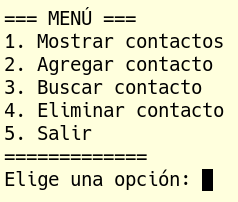

# Lunes 20/01/2025

## UD4. Introducción a la programación

- **10:15 - 09:15**: Sesión 54
- **11:45 - 12:45**: Sesión 55

## Qué trataremos
Hoy, partiendo de un ejemplo de agenda (una lista de diccionarios) que contiene nombre y número de teléfono y de un menú, vamos a crear nuestra aplicacion agenda. Todas las funciones estarán en un módulo (archivo *.py que importaremos en el archivo principal al que llamaremos app.py).

Aquí os dejo los archivos [funciones.py]() y [app.py]() tal como he explicado en clase.

## Recursos
- [1] [Python para principiantes - UniWebSidad](https://uniwebsidad.com/libros/python?from=librosweb).
- [2] [Python para principiantes - Microsoft Learn](https://learn.microsoft.com/es-es/training/paths/beginner-python/?utm_source=chatgpt.com).
- [3] [El Libro de Python](https://ellibrodepython.com/).
- [4] [Tutorial oficial de Python - docs-python.org](https://docs.python.org/es/3.13/tutorial/index.html).

## Tareas
- Realizaremos el ejercicio partiendo de la agenda y del menú que tenéis en el siguiente archivo: [ejemplo_agenda_y_menu.py](/Documents/UD4/ejemplo_agenda_y_menu.py).

